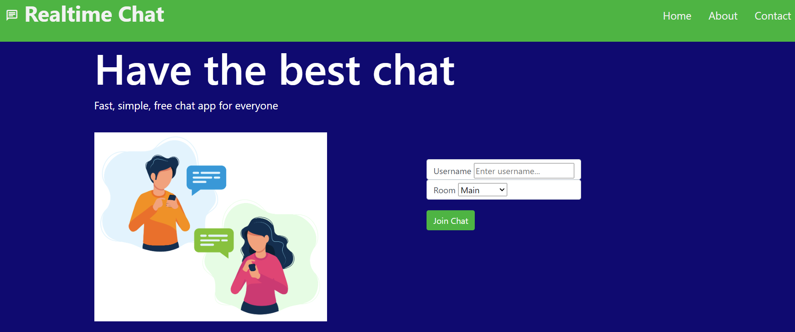

 # <realtime-chat>

## Description

Realtime Chat is an interactive chat website I created. Socket.io was a technology new to me that I used for this project. Socket.io allows developers to create open chat applications that allows users to send and receive messages from several users on the application.

## Usage

On the homepage, create a username, choose which room you would like to join from the dropdown menu, and click "Join Chat" to start chatting with other users.

https://github.com/allstarcoding777/realtime-chat

## License

Please refer to the license in the repo.